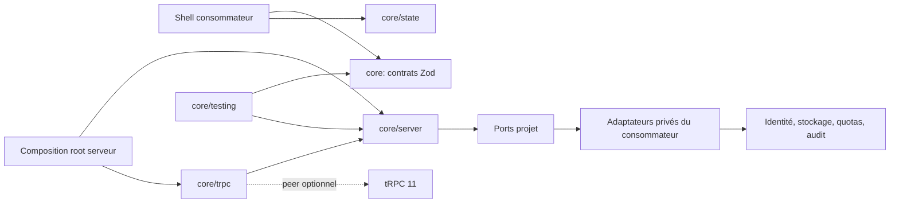

# Design document — kernel headless

## Objectif, état actuel et cible

L'objectif est de concentrer les contrats, politiques d'accès et transitions réutilisables dans un package TypeScript qui ne connaît aucun renderer, transport concret, ORM ou fournisseur.

La fondation est opérationnelle : cinq sous-chemins publics, contrats `uiMeta`, état optimiste, pipeline protégé, adaptateur tRPC et fakes de test sont compilés et testés. Restent avant 1.0 l'intégration d'un domaine pilote, la configuration du Trusted Publisher npm et la validation dans deux shells réels.

## Architecture et frontières de confiance



Frontières de confiance : toute entrée du shell, du réseau et d'un adaptateur est externe et doit être validée. Seul `/server` peut créer une preuve d'accès. `/trpc` traduit le transport sans décider de l'autorisation. `/testing` n'est jamais une dépendance de production.

## Modules verticaux et responsabilités

| Module public | Responsabilité complète | Interdictions |
| --- | --- | --- |
| root | Contrats sérialisables, résultat, erreurs, `uiMeta`, runtime UI sémantique | Node, Zod, tRPC, UI concrète, fournisseurs |
| `/server` | Ports, composition des politiques, preuve, erreurs internes, audit | Transport, ORM, fournisseur concret |
| `/trpc` | Adaptateur tRPC 11, metadata de procédure, mapping d'erreur | Règle métier, stockage, authentification concrète |
| `/state` | Transition pure, optimistic commit/rollback, concurrence | React, store vendor, réseau |
| `/testing` | Builders et fakes déterministes conformes aux ports | Import depuis un artefact de production |

Les futurs modules métier sont verticaux : chacun possède contrat, schéma, politique, service, tests et récupération. Ils dépendent des contrats et ports stables, jamais d'un adaptateur.

## Dépendances autorisées

```text
root       → aucune dépendance plateforme
state      → contrats universels
server     → Zod 4 + contrats universels
trpc       → root + server + peer @trpc/server 11
testing    → root + server + state
adapter    → port stable → fournisseur
```

Aucun cycle n'est autorisé. Le composition root vit chez le consommateur. Zod 4 est la dépendance runtime. tRPC 11 est un peer optionnel et n'est chargé que via `/trpc`.

## Contrats publics

Les contrats publics sont figés par les tests de l'API actuelle :

```ts
type CoreErrorCode =
  | "INVALID_INPUT"
  | "UNAUTHENTICATED"
  | "FORBIDDEN"
  | "RATE_LIMITED"
  | "QUOTA_EXCEEDED"
  | "SERVICE_UNAVAILABLE"
  | "INTERNAL";

type UiMeta<Action extends string, Reason extends string> = Readonly<{
  revision: string;
  allowedActions: Readonly<Record<Action, ActionDecision<Reason>>>;
}>;
```

`AccessGrant` est opaque : sa fabrique et sa marque ne sont jamais exportées. `isAccessGrant` vérifie sa provenance à l'exécution. Les ports d'autorisation, appartenance de ressource, rate limit, quota, horloge, audit et reporting utilisent des objets d'options nommés.

## Pipeline et machine d'état d'accès

```text
received
  → authenticated_context
  → permission_granted
  → resource_owned
  → input_validated
  → quota_available
  → rate_limit_available
  → mutation_intent_audited
  → protected
  → handled | denied | failed
```

Chaque transition peut uniquement avancer ou refuser. Aucun `catch` ne transforme un refus en autorisation. Le quota consommable est réservé au dernier moment défini par sa politique et compensé si le contrat de l'adaptateur l'exige.

## Machine d'état optimiste

```text
confirmed → pending → confirmed
                    ↘ rolled_back
pending + newer operation → superseded
```

Chaque opération reçoit une clé stable et un numéro monotone. Un commit obsolète est ignoré. Un rollback restaure le snapshot confirmé le plus récent, pas un état initial capturé avant des opérations ultérieures.

## Données et tenant ownership

Le kernel ne persiste aucune donnée. Ses valeurs sont immuables et sérialisables, à l'exception de la preuve interne. Tout adaptateur persistant du consommateur doit porter un `tenantId` non nul sur chaque ressource cliente et filtrer par le tenant issu du contexte autorisé. Les identifiants fournis dans l'input ne constituent jamais une preuve d'appartenance.

Le journal d'audit reçoit un événement minimal : type, résultat, horodatage injecté, identifiants opaques de corrélation, permission demandée et raison publique. Il exclut tokens, cookies, entrées sensibles et détails internes.

## Événements de domaine

Le MVP n'introduit pas de bus. Les résultats publics utilisent des unions discriminées et les événements d'audit passent par `AuditPort`. Un consommateur peut les traduire vers sa télémétrie sans coupler le kernel à un fournisseur.

## Politique de fournisseurs et fallback

Le kernel possède les ports ; les applications possèdent les adaptateurs. Aucun fournisseur initial n'est sélectionné pour identité, base, cache ou télémétrie. Les fakes de `/testing` sont réservés aux tests, jamais un fallback silencieux en production. Une dépendance indisponible produit `SERVICE_UNAVAILABLE` et refuse l'opération sensible.

tRPC est l'unique adaptateur de transport ciblé au MVP. Une intégration directe `/server` reste le fallback pour un autre transport ; elle ne modifie pas les politiques.

## Fiabilité, observabilité et coût

- Horloge et générateur d'identifiants injectés pour des tests déterministes.
- Timeouts, retries et idempotency sont des responsabilités explicites des adaptateurs ; aucun retry caché dans les politiques.
- Le même identifiant de corrélation traverse gardes, handler et audit.
- Les compteurs utiles sont les refus par code, latence par garde, conflits optimistic et pannes d'adaptateur.
- Le kernel ne crée aucun service facturé. Son coût direct est le build, la CI et le registre public npm.

## Sécurité

Toutes les entrées et sorties d'adaptateur sont validées. L'autorisation est deny-by-default et indépendante de la visibilité UI. Les erreurs publiques sont stables et expurgées. La chaîne exacte et les tests négatifs sont définis dans le document de sécurité.

## Compromis et décisions

- Des sous-chemins explicites augmentent la configuration de packaging mais garantissent l'isolation des dépendances.
- Un peer tRPC optionnel évite d'imposer le transport, au prix d'un message d'installation requis pour `/trpc`.
- Une preuve runtime plus une marque TypeScript est plus lourde qu'un booléen, mais résiste aux appels accidentels et aux casts ordinaires.
- Le kernel ne fournit pas d'UI universelle : cette contrainte réduit le périmètre et évite une abstraction fausse entre DOM et Native.
- ESM et CJS sont ciblés pour la compatibilité ; leur coût est compensé par des smoke tests réels du tarball.

## Questions ouvertes et critères d'approbation

Avant 1.0, les mainteneurs doivent valider le premier domaine pilote, le maintien du support CJS et les contrats des adaptateurs réels de quota/rate limit/audit.

Le design est approuvé lorsque les cinq frontières de package, l'ordre fail-closed, la propriété des adaptateurs et les critères de publication sont acceptés sans exception implicite.
